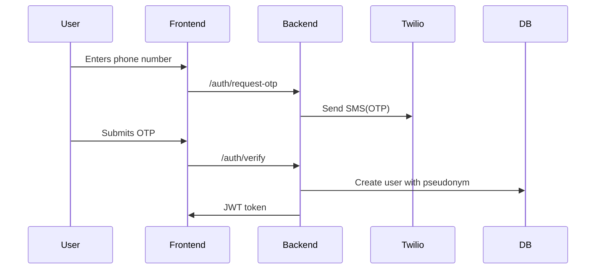
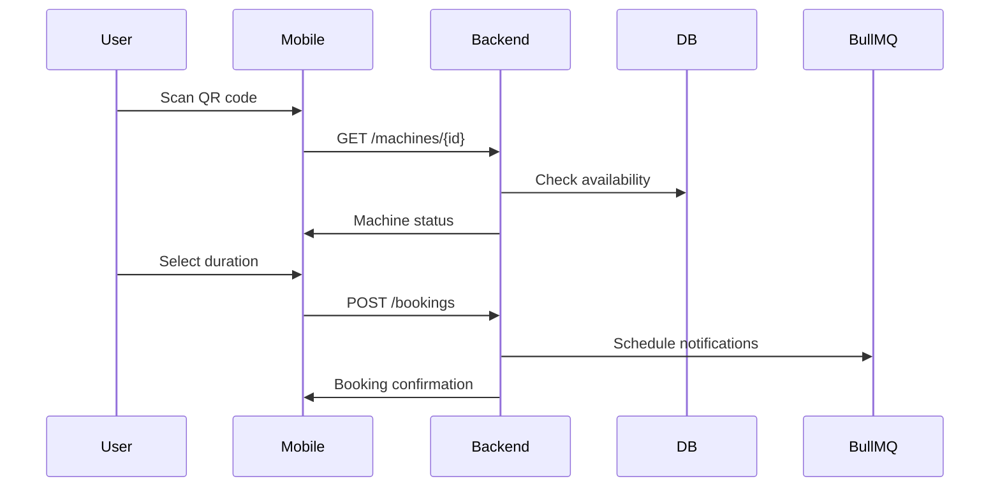
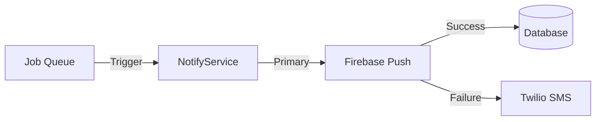

# LaundryMate 🧺
[](https://opensource.org/licenses/MIT)

## WARNING: THIS ENTIRE THING IS VIBE CODED!!! PROCEED WITH CAUTION AND AT YOUR OWN RISK (ALSO, FEEL FREE TO HATE)!!!

**A privacy-first Progressive Web App for dormitory laundry room management**  
Check machine availability, book via QR/NFC, get smart notifications, and ping users - all while maintaining anonymity.

 *High-level architecture diagram*

## Key Features
- 📱 **Zero-install PWA** - Mobile-first web app with offline support
- 🔐 **Anonymous auth** - Phone verification + fun pseudonyms (e.g., "Captain Laundry")
- 🧩 **QR/NFC integration** - Scan to book machines in physical laundry rooms
- 🔔 **Smart notifications** - Web push with SMS fallback + buffer periods
- 🏓 **Ping system** - Notify previous users about forgotten laundry
- 📊 **Real-time dashboard** - Live machine status tracking
- 🔒 **Privacy by design** - Minimal data retention, pseudonymized interactions

## Technology Stack
| Component              | Technology                          | Justification                                                                 |
|------------------------|-------------------------------------|-------------------------------------------------------------------------------|
| **Frontend**           | React + Vite PWA                    | Offline support, fast development, PWA capabilities                           |
| **Styling**            | Tailwind CSS                        | Rapid responsive UI development                                               |
| **Backend**            | Node.js (Express) on AWS Lambda     | Serverless scaling, pay-per-use cost model                                    |
| **Database**           | PostgreSQL (Supabase)               | Free tier, real-time capabilities, and built-in auth                          |
| **Notifications**      | Firebase Cloud Messaging + Twilio   | Reliable push with SMS fallback                                               |
| **Job Queue**          | BullMQ + Redis                      | Delayed notifications and buffer period handling                              |
| **Auth**               | Twilio Verify                       | Low-cost SMS verification                                                     |
| **Hosting**            | Cloudflare Pages + AWS API Gateway  | Global CDN + serverless execution                                             |

## Getting Started

### Prerequisites
- Node.js v18+
- PostgreSQL database
- Twilio account (SMS)
- Firebase project (FCM)

### Installation
```bash
# Clone repository
git clone https://github.com/your-repo/laundrymate.git
cd laundrymate

# Install dependencies
npm install

# Set up environment variables
cp .env.example .env
# Fill in your Twilio, Firebase, and DB credentials
```

### Database Setup
Run schema initialization script:
```bash
npm run db:migrate
```

### Running Locally
```bash
# Start frontend dev server
npm run dev:frontend

# Start backend server
npm run dev:backend

# Access at http://localhost:3000
```

## System Architecture
### Core Data Models
```mermaid
erDiagram
    USER ||--o{ BOOKING : has
    USER {
        uuid id PK
        string phone UNIQUE
        string pseudonym
        jsonb push_subscription
        boolean sms_enabled
    }
    MACHINE ||--o{ BOOKING : processes
    MACHINE {
        uuid id PK
        string name
        enum type
        enum status
        string qr_code
    }
    BOOKING ||--o{ NOTIFICATION : triggers
    BOOKING {
        uuid id PK
        timestamp start_time
        timestamp expected_end_time
        timestamp actual_end_time
        enum status
    }
    NOTIFICATION {
        uuid id PK
        enum type
        enum channel
        enum status
        timestamp scheduled_at
    }
```

### Key Workflows
1. **User Registration**  


2. **Machine Booking**  


3. **Notification Flow**  


## Deployment
1. **Frontend**:  
   ```bash
   npm run build
   # Deploy dist/ to Cloudflare Pages
   ```
   
2. **Backend**:  
   Use Serverless Framework:
   ```bash
   npm install -g serverless
   serverless deploy
   ```

3. **Infrastructure**:  
   - Database: Supabase free tier  
   - Redis: Upstash free plan  
   - SMS: Twilio pay-as-you-go  

## Privacy & Security
- 🔏 Phone numbers stored as bcrypt hashes
- 🪪 All interactions use pseudonyms
- 🗑️ Booking history auto-deleted after 30 days
- 🔍 No personal analytics collection
- 🔑 JWT authentication with short-lived tokens

## Contributing
Pull requests welcome! See [CONTRIBUTING.md](CONTRIBUTING.md) for guidelines.

## License
MIT - See [LICENSE](LICENSE)
```

---

### Recommended Repository Structure:
```
/laundrymate
├── frontend
│   ├── public
│   ├── src
│   │   ├── components
│   │   ├── services
│   │   └── sw.js (Service Worker)
│   └── vite.config.js (PWA setup)
├── backend
│   ├── src
│   │   ├── controllers
│   │   ├── services
│   │   └── workers
│   └── serverless.yml
├── docs
│   ├── ARCHITECTURE.md
│   └── DATA_MODELS.md
├── .env.example
├── package.json
├── README.md
└── LICENSE
```
